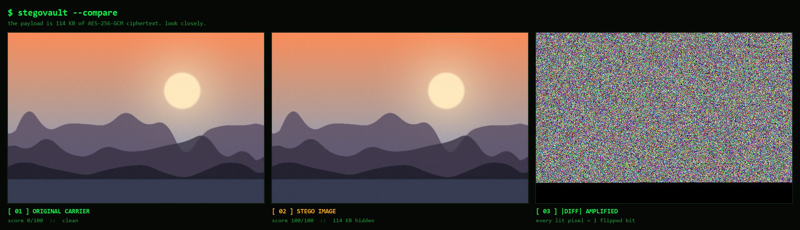
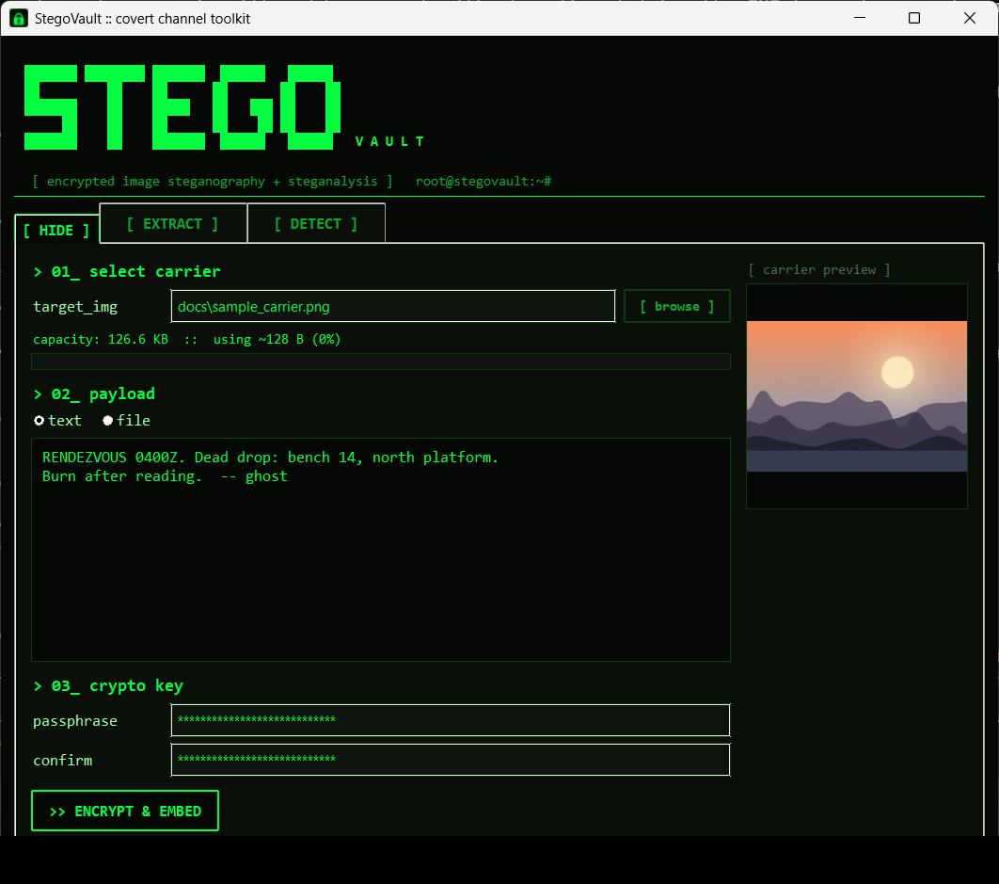
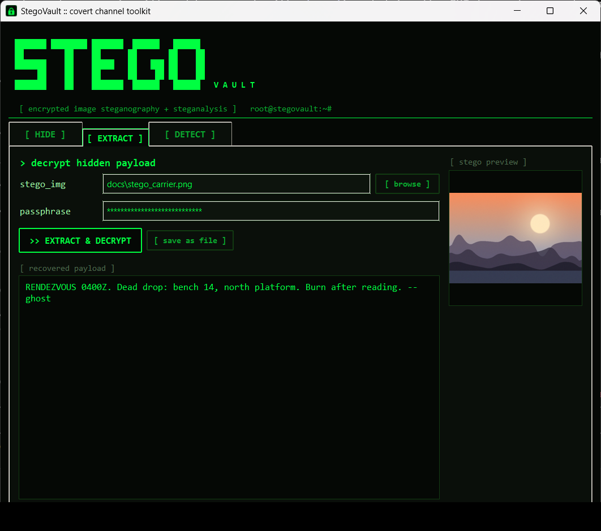
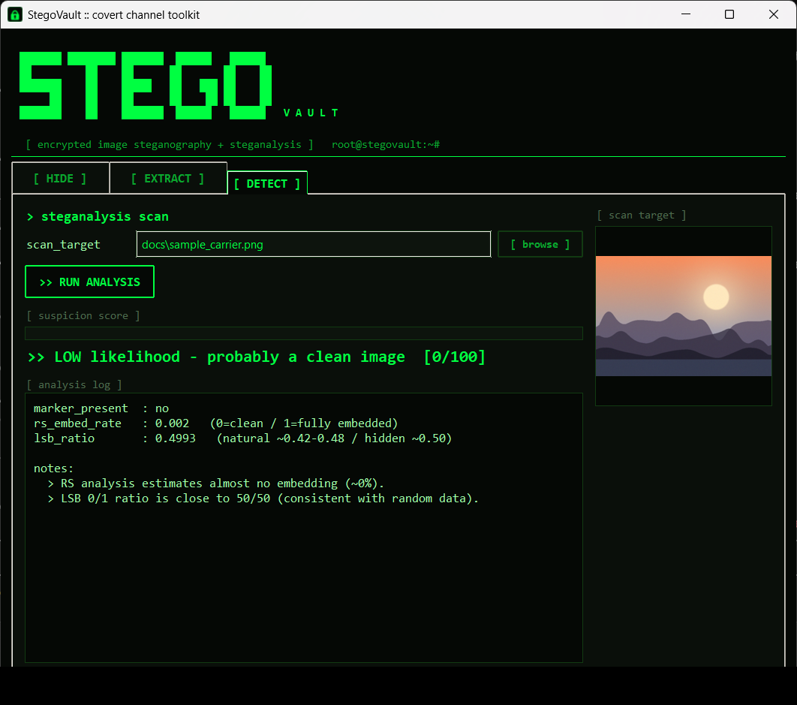
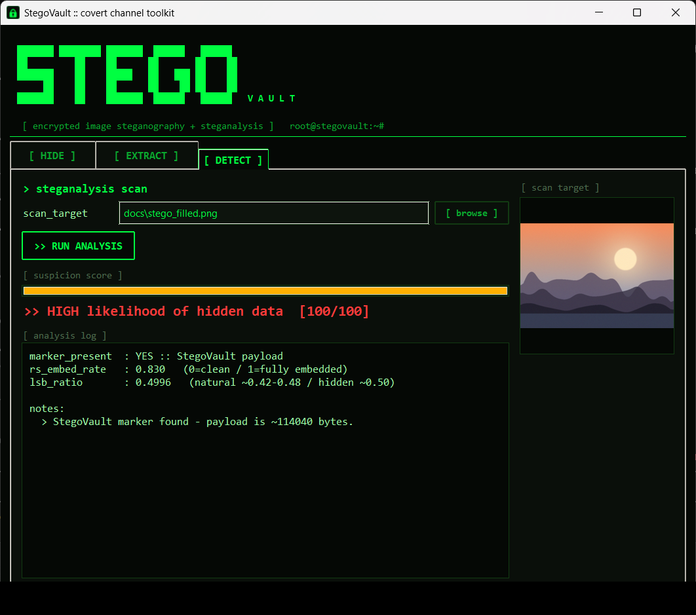

<div align="center">

```
 ███████ ████████ ███████  ██████   ██████
 ██         ██    ██      ██       ██    ██
 ███████    ██    █████   ██   ███ ██    ██
      ██    ██    ██      ██    ██ ██    ██
 ███████    ██    ███████  ██████   ██████   V A U L T
```

# StegoVault

**Hide a message so it cannot be read — and so nobody knows it is there.**<br>
**Then build the tool that catches you doing it.**


</div>

## Spot the Difference

One of these images is carrying **114 KB of AES-256-GCM ciphertext**.



Panel 3 is the pixel difference amplified ×255. Every lit dot is one bit that
moved — a colour shift of 1/255. Your eye cannot separate panels 1 and 2.
**That is exactly why steganalysis exists.**

## What It Does

Most steganography projects stop at hiding. This one implements **both sides**.

| module | role |
|---|---|
| **`[ HIDE ]`** | encrypt a message or file under a passphrase, then bury the ciphertext one bit at a time in an ordinary PNG |
| **`[ EXTRACT ]`** | pull it back — a wrong passphrase or a single altered bit is *refused*, not silently mangled |
| **`[ DETECT ]`** | score any image 0–100 for hidden data, including images made by **other** tools |

Three layers, three different attacks defeated:

| layer | technique | stops an adversary from |
|---|---|---|
| cryptography | AES-256-GCM | reading the message |
| steganography | LSB embedding | knowing a message exists |
| integrity | GCM authentication tag | silently altering it |

## Screenshots

<table>
<tr>
<td width="50%"><br><sub><b>[ HIDE ]</b> live capacity meter, text or file payload</sub></td>
<td width="50%"><br><sub><b>[ EXTRACT ]</b> payload recovered and tamper-checked</sub></td>
</tr>
<tr>
<td width="50%"><br><sub><b>[ DETECT ]</b> clean image, correctly cleared</sub></td>
<td width="50%"><br><sub><b>[ DETECT ]</b> same photo, now carrying 114 KB</sub></td>
</tr>
</table>

## How the Payload Is Built

The secret is already ciphertext before it ever touches a pixel.

```
passphrase ──► PBKDF2-HMAC-SHA256 (200k, random salt) ──► 256-bit key
                                                              │
plaintext ────────────────► AES-256-GCM encrypt ◄─────────────┘
                                    │
    blob = salt(16) │ nonce(12) │ ciphertext │ GCM tag(16)
                                    │
  pixels = "SVLT"(4) │ length(4) │ blob      ← 1 bit per colour channel
```

- **PBKDF2 at 200k iterations** — a passphrase is not a key; stretching makes
  every brute-force guess ~200,000× more expensive.
- **Random salt** — identical passphrases derive different keys, killing
  rainbow tables.
- **GCM tag** — tampering is *detected*, never decrypted into plausible garbage.
- **Magic + length header** — extraction fails fast on an ordinary image.

Capacity is `width × height × 3 ÷ 8` — a 12 MP photo hides about 4.5 MB.

## How Detection Works

`stego/detect.py` implements **RS Analysis** (Fridrich, Goljan & Du, 2001) from
scratch in NumPy — no SciPy, no ML, no black box. It groups neighbouring pixels,
measures smoothness, flips LSBs by a mask, measures again, and solves the
resulting quadratic for `p`: the estimated fraction of the LSB plane carrying data.

Every number below is real output from `selftest.py`:

| target | RS rate | score | verdict |
|---|---|---|---|
| natural photo, untouched | `0.002` | **0** | LOW |
| StegoVault, 127-byte message | `0.003` | **100** | HIGH *(marker)* |
| StegoVault, 88% of capacity | `0.830` | **100** | HIGH *(RS alone)* |
| **foreign tool, no marker, 50% embed** | `0.509` | **51** | POSSIBLE |

That last row matters most: no `SVLT` marker, mimicking a different tool
entirely, and RS still flags it on statistics alone. The detector is not just
recognising its own output.

> **Why RS and not chi-square?** The classic chi-square "Pairs of Values" test
> false-positives on ordinary photographs — sensor noise balances the even/odd
> counts, so clean images look suspicious. A detector that cries wolf on real
> photos is useless to an analyst.

## Quick Start

```bash
git clone https://github.com/jaylalkiya/StegoVault.git
cd StegoVault
pip install -r requirements.txt
python app.py
```

Python 3.9+. `tkinter` ships with the standard Windows/macOS installer
(Linux: `sudo apt install python3-tk`).

Two images ship with the repo, so the detector has something to chew on
immediately:

```
[ DETECT ]   docs/sample_carrier.png  ->   0/100  LOW
             docs/stego_filled.png    -> 100/100  HIGH    <- they look identical
[ HIDE ]     carrier + message + passphrase -> save mine.png
[ EXTRACT ]  mine.png + passphrase -> message returns
             wrong passphrase      -> refused
```

Verify the engine headlessly — round-trip, wrong password, single-bit tamper,
clean-image handling, and clean-vs-stego detection:

```bash
python selftest.py        # 7/7 checks
```

Build a standalone Windows binary (no Python needed on the target):

```bash
pip install pyinstaller && pyinstaller StegoVault.spec
```

## Project Layout

```
app.py            Tkinter GUI - three tabs, threaded so the UI never blocks
selftest.py       headless end-to-end proof, 7 checks
StegoVault.spec   PyInstaller build recipe
stego/crypto.py   AES-256-GCM + PBKDF2 - 82 lines, no custom crypto
stego/embed.py    LSB hide / extract / capacity, vectorised in NumPy
stego/detect.py   RS analysis + marker + LSB ratio -> 0-100 score
docs/             sample carrier, pre-made stego image, screenshots
```

Every cryptographic primitive comes from the audited `cryptography` library.
**No hand-rolled crypto** — only the steganography and steganalysis are
implemented here, which is where the interesting work is.

## Limitations

- **LSB is fragile by design.** Re-compress to JPEG, resize, or screenshot the
  stego image and the payload is gone. Production tools embed in the DCT/DWT
  domain to survive that.
- **The score is likelihood, not proof** — evidence for an analyst, the same way
  real steganalysis works.
- **RS degenerates at exactly 100% embedding**, a known property of the
  estimator; such saturated images are caught by the marker and the near-0.500
  LSB ratio instead.
- **A PyInstaller .exe is packaging, not protection.** Frozen bytecode decompiles.
- **Only lossless carriers** (PNG/BMP/TIFF) can hide data. Any format can be analysed.

## References

Fridrich, Goljan & Du, *Reliable Detection of LSB Steganography in Color and
Grayscale Images*, ACM Multimedia 2001 · NIST SP 800-38D (GCM) · RFC 8018 (PBKDF2)

---

<div align="center">

MIT licensed · built to learn offensive **and** defensive technique
**Use only on images and data you are authorised to touch.**

</div>
